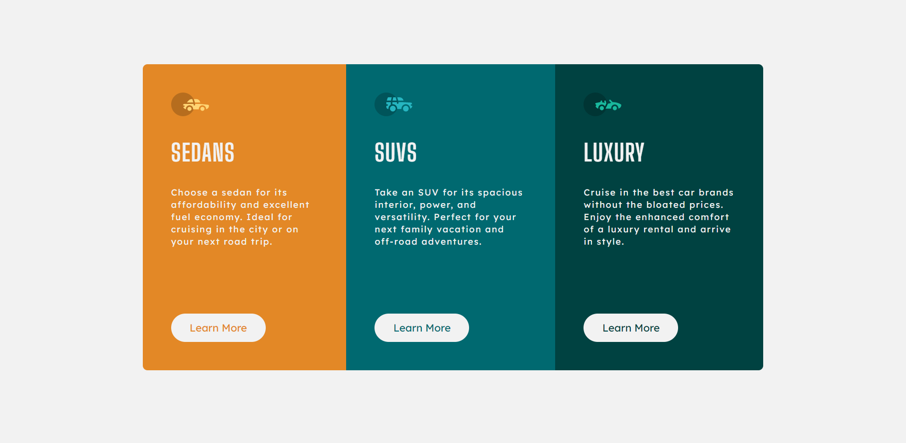

# Frontend Mentor - 3-column preview card component solution

This is a solution to the [3-column preview card component challenge on Frontend Mentor](https://www.frontendmentor.io/challenges/3column-preview-card-component-pH92eAR2-). Frontend Mentor challenges help you improve your coding skills by building realistic projects. 

## Table of contents

- [Overview](#overview)
  - [The challenge](#the-challenge)
  - [Screenshot](#screenshot)
  - [Links](#links)
- [My process](#my-process)
  - [Built with](#built-with)
  - [What I learned](#what-i-learned)
  - [Continued development](#continued-development)
  - [Useful resources](#useful-resources)
- [Author](#author)
- [Acknowledgments](#acknowledgments)

**Note: Delete this note and update the table of contents based on what sections you keep.**

## Overview

### The challenge

Users should be able to:

- View the optimal layout depending on their device's screen size
- See hover states for interactive elements

### Screenshot

### Links

- Solution URL: https://github.com/nurilak/3-column-preview-card
- Live Site URL: https://nurilak.github.io/3-column-preview-card/

## My process

### Built with

- Semantic HTML5 markup
- CSS custom properties
- Flexbox
- CSS Grid
- Media Query
- HTML and CSS Comments
- HTML Section element
- Other parts of HTML and CSS

### What I learned

In this challenge I learn more about CSS of website responsivnes and image configurations, also usage <section> HTML element and code commenting.

### Continued development

My current plan is to learn much more about CSS to master it and later on JAVASCRIPT.

### Useful resources

These are resourses i use ofter to understasand and learn more about HTML, CSS and JAVASCRIPT LANGUAGES.

- Bitcamp.ge - [resource 1](https://www.bitcamp.ge/)
- Bitcamp Youtube Channel - [resource 2](https://www.youtube.com/@bitcampge)

- Kewin Powell's Youtube Channel - [resource 3](https://www.youtube.com/@KevinPowell)

- Google Search is Greatest Resourse also -

## Author

- Frontend Mentor - [@nurilak](https://www.frontendmentor.io/profile/nurilak)
- Linkedin - [@nurio1](https://www.linkedin.com/in/nurio1/)
- Facebook - [@nurio1](https://www.facebook.com/nurio1)
